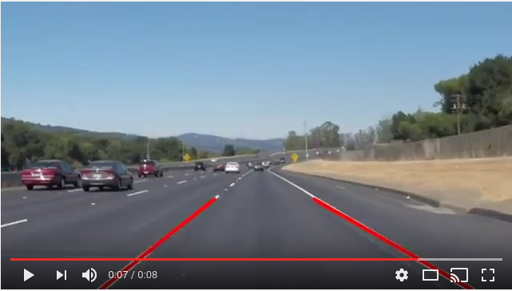
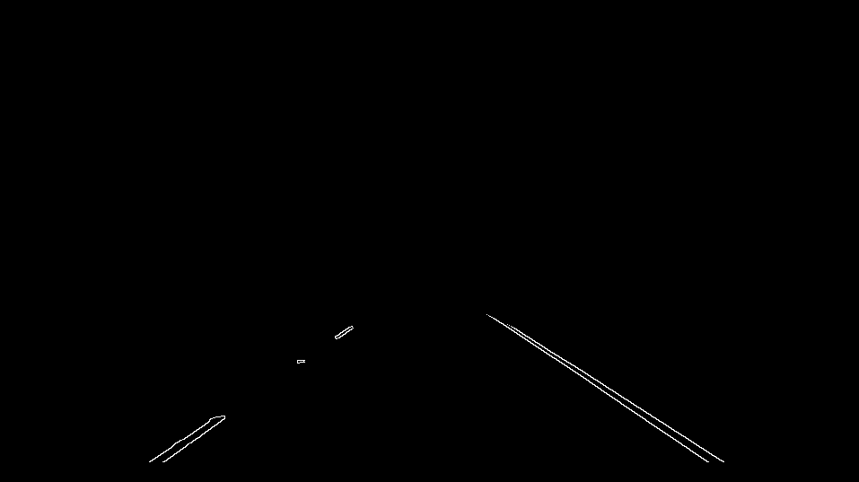

# Finding Lane Lines on the Road

This project uses a combination of Canny Edge Detection and the Hough Transform to detect lane lines in an input video stream.

## Writeup

### Goals
The goals of this project are the following:

    1. Make a pipeline that finds lane lines on the road.
    2. Reflect on my work in a written report.

### Demo

Execute the [iPython notebook](https://github.com/alexhagiopol/lane_lines/blob/develop/P1.ipynb)
in this repo to view the working implementation and its results. Below is
an example result of my lane line detection pipeline on a video stream:

### Reflection

#### 1. Pipeline Description

The pipeline begins by preparing the local filesystem to read and write
images and videos. The pipeline then executes the detect function in a loop
on every input image or every input video frame depending on the application.
Finally, the pipeline saves edited images or videos that contain the lane line
estimates drawn on each image or video frame.

The core of the pipeline is a single function, detect(image),
that identifies lane lines in a single image or video frame. detect() has
three stages `1. filtering`, `2. edge and line segment detection`, and
`3. line segment combination`.

In the `filtering` stage, assumptions are
made about which image information is useful for lane line detection, and non
useful information is thrown away before further processing. The `filtering`
stage implements 3 techniques: color masking, region of interest masking,
and Gaussian blurring. Color masking is used to only process parts of the image that have colors
similar to typical lane lines i.e. colors similar to white and yellow. Region
of interest masking is used to only process parts of the image that are in
the image region where lane lines would typically be found. These masks
are combined using the bitwise AND method to produce an output that typically
only contains the lane lines themselves along with some occasional spurious
information. Gaussian blurring is used to remove spuriously high or low
pixel values to add numerical stability for gradient calculations in future steps.

In the `edge and line segment detection` stage, the Canny edge detector
is used to detect high-gradient edges in the scene. After filtering, applying
the Canny method, the lane lines become clearly outlined in the following
example image:

[

The `edge and line segment detection` continues with the Hough transform,
which detects from among the edge pixels detected by the Canny method
a set of "most voted" straight lines represented by their endpoints.

The final, `line segment combination` step takes the Hough line endpoints for
the left and right halves of the image and uses them to compute a line of
best fit via linear regression.

#### 2. Potential Shortcomings

The first shortcoming of this pipeline is the number of assumptions made
to make it work on the given video and image datasets. We assumed that
lane lines have colors close to white and yellow. We also assumed that
lane lines appear in a roughly trapezoidal region in the the camera's view.
What if the car veers off to one side, and the lane lines no longer conform
to the assumptions?

The second shortcoming of this work is that we applied both the Hough transform
to detect lines and linear regression to also detect lines. Since the output
of the Canny edge detector is a binary image where white pixels form the edges,
we simply could have passed the locations of all white pixels from Canny edge
detection directly to the linear regression method. However, this will
make linear regression slower because of the larger matrix inversion required.
More analysis is needed to see whether a speed improvement can be made by
eliminating Hough transform while maintaining accuracy.

The third shortcoming of this work is that the algorithm implemented does
not take into account knowledge about the mathematical relationship between
state estimates in different frames. For example, it's common sense that
if the lane lines are estimated to be at a given configuration in frame n,
then the lane lines are very likely to be near that same configuration in
lane n + 1. This logic is not implemented in the current pipeline.

#### 3. Future Work

The first shortcoming could be addressed by no longer searching for lane
lines according to a hard coded geometrical search pattern and instead
implementing clustering algorithms that would determine which pixels are
associated with which lane lines. For example, if we are given points
representing the lane lines we may no longer need to divide the image and
points into left and right halves if we applied k-means clustering with
k = 2.

The second shortcoming could be addressed by performing asymptotic analysis
and experiments on the Hough transform algorithm and the linear regression
algorithm. Perhaps there is an optimal tradeoff between the speed gain of
removing Hough transform and the speed loss of increasing the input size
of linear regression for datasets that are common to self-driving car applications.

The third shortcoming could be addressed by implementing a form of recursize
Bayesian state estimation that takes the output of detect() as the noisy measurement
for each frame. An example of this would be a Kalman filter. We would have
to first mathematical model the behavior of the lane lines and then
compute the derivatives of this model to implement this approach.