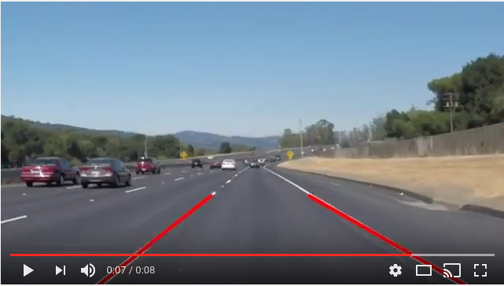

# Finding Lane Lines on the Road

This project uses a combination of Canny Edge Detection and the Hough Transform to detect lane lines in an input video stream.

## Writeup

### Goals
The goals of this project are the following:

    1. Make a pipeline that finds lane lines on the road.
    2. Reflect on my work in a written report.

### Demo

Execute the [iPython notebook](https://github.com/alexhagiopol/lane_lines/blob/develop/P1.ipynb)
in this repo to view the working implementation and its results. Below is
an example result of my lane line detection pipeline on a video stream:

### Reflection

#### 1. Pipeline Description

The

#### 2. Potential Shortcomings

#### 3. Future Work
